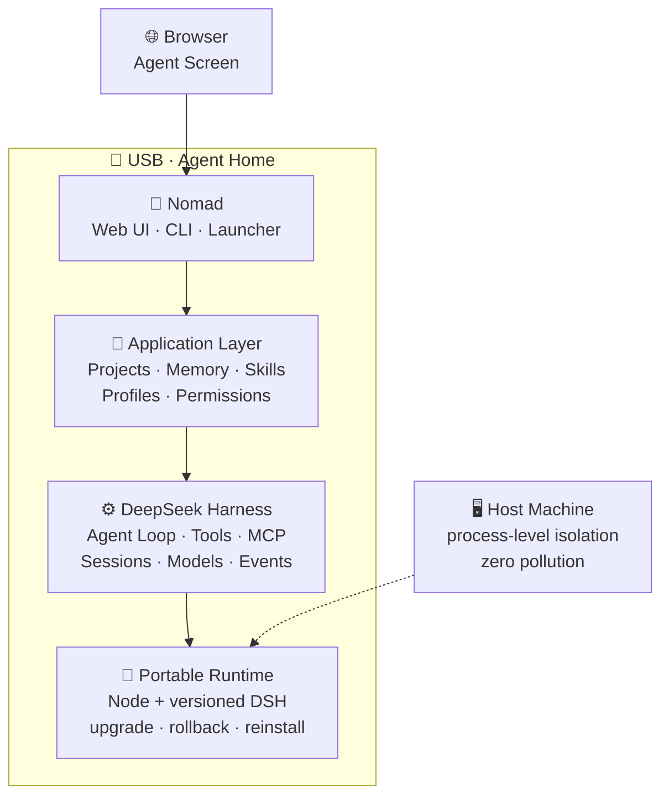

<div align="center">


# 🧭 Nomad

### Portable Agent OS — your Agent's home lives on a USB drive, the browser is its screen

[简体中文](README.md) ｜ **English**

[](LICENSE)
[](https://nodejs.org)
[](#-testing--self-checks)
[](#-running-from-source)
[](https://github.com/deepseek-ai/deepseek-harness)
[](#-deploying-to-a-usb-drive)

**DSH = Agent Engine　·　Nomad = Product / OS Layer　·　USB = Agent Home　·　Browser = Agent Screen**

Nomad is not an Agent built from scratch — it is a **portable Agent operating system built on top of
DeepSeek Harness (DSH)**: the engine is upstream, but **the home is yours**. Whichever computer you
plug into, your Agent lives on that computer's USB drive.

</div>

---

## ✨ Core Values

| | Value | In one sentence |
|:---:|---|---|
| 🎒 | **Portable** | New computer: same Agent. New OS: same Agent. New USB: fully migratable |
| 💾 | **Persistent** | Upgrade the runtime — Memory / Projects / Sessions survive |
| 🔑 | **Personal** | Data, config, credentials, sessions — all stay on your own drive |
| 🧩 | **Extensible** | Every customization goes through official extension points, **Core patches = 0**, no upstream fork |
| ⏮️ | **Upgradable** | Versioned DSH upgrades with one-command `nomad rollback` |
| 🛟 | **Recoverable** | `nomad backup` / `restore` lifecycle commands, zero-dependency backup & restore |
| 🛡️ | **Secure** | Process-level host isolation: no env vars touched, no registry writes, zero host pollution |

**The target experience**:

```text
Plug in USB → start Nomad → browser opens the Nomad Web UI
   → work with your Agent → important state is written to the USB → unplug
   → move to another computer → pick up where you left off
```

## 🏗️ Architecture



> **Runtime and Data are physically separated**: `runtime/` is replaceable, upgradable, rollbackable,
> re-downloadable; `data/` must persist long-term — the two are **never mixed**. A rollback is a
> one-line `entry` rewrite of the manifest pointer (manifest indirection instead of symlinks, see
> [ADR-0016](docs/DECISIONS.md)).

## 🚀 Quick Start

```bash
# Health check (read-only, 21 items): paths / secrets / directories / runtime /
# isolation / ports / host-pollution probes / literal-scan / all profiles /
# skills / data plane / permission tiers
nomad doctor

# Print the startup plan without launching anything (full argv + isolation plan)
nomad start --dry-run

# Start (background) → opens the browser automatically once ready; use --foreground to stay attached
nomad start

# Day-to-day management
nomad status          # instance status
nomad url             # print the token-bearing URL (sensitive — do not share)
nomad open            # use this when the browser shows "authentication required"
nomad logs            # logs
nomad stop            # stop
```

Lifecycle & extension management:

```bash
nomad backup                    # back up on-disk data (zero-dependency recursive copy + manifest)
nomad restore <backup-dir>      # merged restore (overwrites same names, never deletes extras)
nomad projects                  # read-only listing of on-disk DSH workspaces / projects
nomad rollback [<version>]      # list or switch available DSH runtime versions
nomad skill list                # manage on-disk Agent skills (hot-reload, no restart needed)
nomad storage report            # data panorama: sizes / file counts / cleanable items
nomad update --check            # check for new DSH versions (read-only; upgrades require --yes, old versions stay rollbackable)
```

On Windows you can simply double-click: `Nomad.cmd` (start) ｜ `Nomad-Restart.cmd` (restart) ｜
`Nomad-Stop.cmd` (stop) ｜ `Nomad-Doctor.cmd` (health check).

> [!TIP]
> After changing plugins or configuration you **must restart the instance** for changes to take
> effect (client modules are assembled at startup) — in the development loop `Nomad-Restart.cmd`
> is the one you'll use most. See [`docs/DEVELOPMENT.md`](docs/DEVELOPMENT.md) for the daily workflow.

> [!NOTE]
> **Browser shows `dsh web authentication required`?** That is not a bug — it is DSH's auth design:
> the URL must carry this launch's `?token=…`, so a bare address always gets a 401. In order:
> ① `nomad open`; ② `nomad url` to get the full address and paste it manually;
> ③ set `web.browser_path` in `config/nomad.yaml` to point at your browser executable.
> `nomad doctor` reports "browser handoff" and "web auth handshake" as separate items, so you can
> pinpoint exactly which link broke.

## 📦 Running from Source

> [!IMPORTANT]
> **This repository does not contain `runtime/`** (Node + DSH together ≈ 664 MB). Runtimes are
> managed per version and excluded via `.gitignore` — they **never enter version control**. The
> repository itself is Nomad's **product layer and portability layer** source (97 files / ≈ 500 KB).

Two ways to use the repo after cloning:

**A. Read / contribute — zero install**

`launcher/`, `packages/`, `docs/`, `tests/` are all **zero-dependency pure JS / Markdown**:
no TypeScript, no build step, no npm packages. The only requirement is a local Node 20+ to run tests.

```bash
node --test tests/*.test.js       # 245 unit tests (25 test files), zero dependencies
```

**B. Fully reproduce the portable runtime (dev-machine workflow)**

The Agent engine [`@deepseek-ai/dsh`](https://github.com/deepseek-ai/deepseek-harness) is a
**public npm package**; you can assemble the runtime yourself from official versions
(SHA-256 verification of the official Node package + `npm install @deepseek-ai/dsh@<version>`).
The full pipeline is in [`docs/DEVELOPMENT.md`](docs/DEVELOPMENT.md) §8 (runtime packaging pipeline).

## 🧪 Testing & Self-Checks

```bash
node --test tests/*.test.js             # 245 unit tests
node tests/smoke/portable-smoke.js      # end-to-end smoke (stand-in runtime, no real DSH needed)
node tests/smoke/stale-state-guard.js   # PID-reuse safety gate
node tests/smoke/real-runtime-smoke.js  # real-DSH end-to-end (stops any running instance)
```

Health-check coverage: paths / secrets / directory baseline / runtime package integrity
(lockfile reconciliation) / isolation / ports / host-pollution probes / **literal-directory scan**
(auto-detects accidental `%VAR%`-style writes) / browser handoff / web auth handshake /
**skills loading** / **data plane** / **permission tiers**.

> The packaged `runtime/` (Node v22.23.3 + DSH 0.2.1-alpha.1, 32,089 files / 603.7 MB total)
> makes the target machine **zero-compile, zero-npm, zero-Node-install**.
> See [`docs/PHASE1_LAUNCHER.md`](docs/PHASE1_LAUNCHER.md).

<details>
<summary><b>🌱 Deploying to a USB drive (removable disk) — click for key points</b></summary>

```bash
node tools/deploy-usb.js --target E:\ --dry-run              # precheck: read-only, prints the plan
node tools/deploy-usb.js --target E:\                        # full deploy: 32,146 files / 604 MB
node tools/deploy-usb.js --target E:\ --app-only --force    # daily dev: app layer only (sub-second)
```

- **Use `--app-only` for daily development**: skips `runtime/` (99.5% of the payload), syncs only
  ~57 files / 481 KB — measured **1.3 s**. It verifies the runtime via a version stamp and refuses
  to continue on mismatch — fast, but never sloppy.
- **Use the drive root** (`E:\`), not a subdirectory — the tree contains one 264-character path that
  relies on Node's libuv long-path support; the smaller the margin, the bigger the risk.
- **Whitelist-driven**: `vendor/` (upstream sources) / `.cache-dev/` (download cache) /
  `.workbuddy/` / `data/` **never ship to the drive**; the target drive's `data/` is freshly
  initialized as an empty skeleton (no real keys land on the drive, ADR-0019).
- **Resumable**: files that already exist with matching sizes are skipped — after an interruption,
  just **re-run as-is**.
- **Stop the instance on the target drive before deploying**: a running instance holds its loaded
  files, so overwriting hits `EPERM` (the tool reports this up front via an "overwrite probe").
- After deploying, double-click `Nomad-Doctor.cmd` for the health check and `Nomad.cmd` to start
  (use `Nomad-Restart.cmd` if it's already running).
- See [`docs/DEPLOY.md`](docs/DEPLOY.md) and **ADR-0027**.

</details>

## 📁 Repository Layout

| Path | Description |
| --- | --- |
| `launcher/` | **Launcher (zero-dependency Node CLI + runtime supervisor)** |
| `packages/` | L4-a patch layer + zero-build client plugins: brand / panel / theme / locale, etc. |
| `config/` | `nomad.yaml` `providers.yaml` `permissions.yaml` `compatibility.yaml` |
| `tests/` | Unit tests + end-to-end smoke + stand-in runtime fixtures |
| `docs/` | Architecture / source map / data model / portability / security / testing / upstream / **decisions (ADR)** / UI / development / roadmap / launcher / deployment |
| `tools/` | Dev-machine tools (**removable-drive deployment**: `tools/deploy-usb.js`) |
| `AGENTS.md` | **The AI development rulebook (required reading)** |
| `LICENSE` | **Full MIT license text** |
| `THIRD_PARTY_NOTICES.md` | Aggregated third-party components & licenses |
| `runtime/` `data/` `workspace/` `skills/` `profiles/` `mcp/` | Runtime & user data — **never in version control** (see `.gitignore`) |

## 🗺️ Roadmap

| Phase | Goal | Status |
|:---:| --- | --- |
| Phase 0 | Source reconnaissance → `docs/DSH_SOURCE_MAP.md` | ✅ Done |
| Phase 1 | Portable bootstrap (Launcher → DSH → Web → Browser) | ✅ Done (runtime packaged, real-DSH end-to-end closed loop) |
| Phase 2 | Nomad Web UI (V1 loop: panel / brand / theme / lifecycle commands) | ✅ V1 done |
| Phase 3 | Nomad Agent OS (Profiles / Skills / data plane / Permissions / Runtime Manager / panel integration) | ✅ Done (final on-drive acceptance in progress) |

Milestones & checklists: [`docs/ROADMAP.md`](docs/ROADMAP.md) · technical decisions: [`docs/DECISIONS.md`](docs/DECISIONS.md).

## 🤖 For AI Coding Assistants

Paste [`docs/BOOTSTRAP_PROMPT.md`](docs/BOOTSTRAP_PROMPT.md) as the first message of every new
session, and follow [`AGENTS.md`](AGENTS.md).

## ⚖️ License & Attribution

- **Nomad is built on DeepSeek Harness (DSH)** — the Agent engine is provided upstream; Nomad only
  builds the product layer and the portability layer.

| Component | License | Notes |
| --- | --- | --- |
| **Nomad (this project)** | [MIT](LICENSE) · © 2026 iCurrer | Every `packages/*/package.json` declares `"license": "MIT"` |
| **Upstream `@deepseek-ai/dsh`** | MIT · © 2026 [DeepSeek](https://github.com/deepseek-ai/deepseek-harness) | Public repo, public build, compliant |
| **561 transitive dependencies** | MIT / Apache-2.0 / ISC / BSD mostly | **No GPL / AGPL or other strong copyleft**; aggregated list in [`THIRD_PARTY_NOTICES.md`](THIRD_PARTY_NOTICES.md) |

- **No upstream source modified**: core patch count = **0**; every customization goes through
  officially documented extension points (Cordis plugins / `cordis.patch.yml` line patches /
  client plugin slots / theme token overrides / the locale service).
- **Trademark notice**: DSH / DeepSeek Harness are registered trademarks of DeepSeek and may not be
  used as a project name without authorization — this project's name, `Nomad`, contains no such
  trademark. Nomad is an independent project with **no affiliation, sponsorship, or endorsement
  relationship** with DeepSeek. "Built on DeepSeek Harness" is descriptive use explicitly permitted
  by the upstream `BRAND_GUIDELINES`. The same notice also lives inside the product: Nomad panel →
  **About** section.

## ⚠️ Disclaimers & Boundaries

- Nomad does not rewrite DSH's engine capabilities; it only adds the product layer and portability layer.
- DSH is still a developer preview: **no tracking master, no automatic upgrades** — always versioned
  runtime + rollbackable workflow.
- Host isolation is **process-level**: Nomad does not modify system environment variables, the
  registry, or PATH. But **the browser belongs to the host** — its history/cache/sessions are not
  managed by Nomad (see [`docs/HOST_ISOLATION.md`](docs/HOST_ISOLATION.md)).
- **Credential safety**: the model API key is stored on the drive at
  `data/dsh-home/.credentials.yaml` (plaintext). Safeguard the physical drive accordingly;
  `data/` never enters version control.

---

<div align="center">

**Nomad** · built on [DeepSeek Harness](https://github.com/deepseek-ai/deepseek-harness) · released under the [MIT](LICENSE) license

</div>
