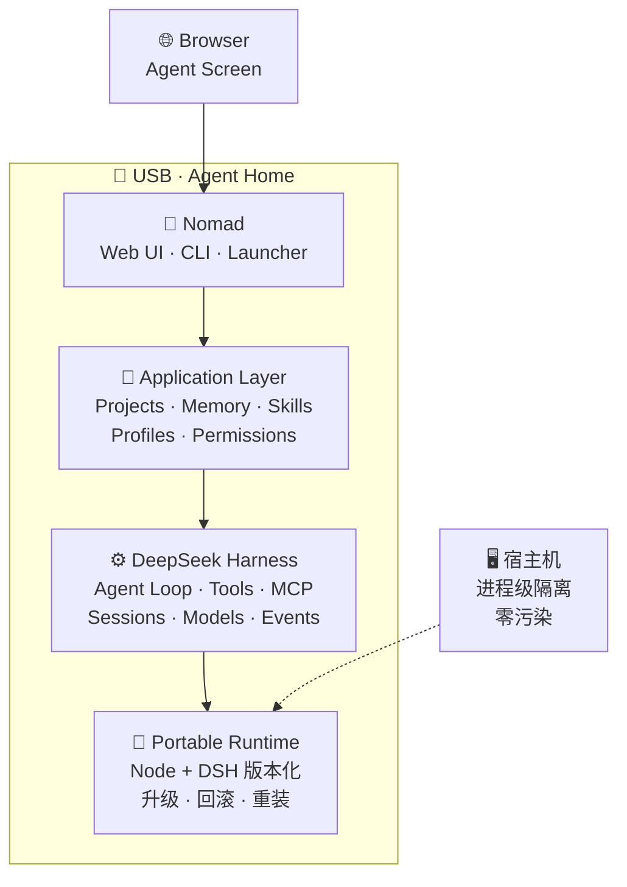

<div align="center">

# 🧭 Nomad

### Portable Agent OS —— 把 Agent 的家装进 U 盘，把浏览器变成它的屏幕

[](LICENSE)
[](https://nodejs.org)
[](#-测试与自检)
[](#-从源码运行)
[](https://github.com/deepseek-ai/deepseek-harness)
[](#-部署到-u-盘)

**DSH ＝ Agent Engine　·　Nomad ＝ Product / OS Layer　·　USB ＝ Agent Home　·　Browser ＝ Agent Screen**

Nomad 不是从零开发的 Agent，而是构建在 **DeepSeek Harness（DSH）** 之上的便携 Agent 操作系统：
引擎是上游的，**家是你的** —— 插上哪台电脑，Agent 就住在哪台电脑的 U 盘里。

</div>

---

## ✨ 核心价值

| | 价值 | 一句话 |
|:---:|---|---|
| 🎒 | **Portable** | 换电脑：Agent 不换；换系统：Agent 不换；换 USB：Agent 可迁移 |
| 💾 | **Persistent** | 升级 Runtime，Memory / Project / Session 不丢 |
| 🔑 | **Personal** | 数据、配置、凭据、会话，全部只在你自己的盘里 |
| 🧩 | **Extensible** | 全部定制走官方扩展点，**Core Patch ＝ 0**，不 fork 上游 |
| ⏮️ | **Upgradable** | DSH 版本化升级，`nomad rollback` 一键回滚 |
| 🛟 | **Recoverable** | `nomad backup` / `restore` 生命周期命令，零依赖备份恢复 |
| 🛡️ | **Secure** | 进程级宿主隔离：不改环境变量、不动注册表、宿主零污染 |

**目标体验**：

```text
插入 USB → 启动 Nomad → 浏览器打开 Nomad Web UI
   → 使用 Agent → 重要状态写入 USB → 拔走 USB
   → 换另一台电脑 → 继续工作
```

## 🏗️ 架构一览



> **Runtime 与 Data 物理分离**：`runtime/` 可替换、可升级、可回滚、可重新下载；
> `data/` 必须长期存在 —— 两者**永不混放**。回滚 ＝ 改写版本指针的一行 `entry`
> （清单间接而非符号链接，见 [ADR-0016](docs/DECISIONS.md)）。

## 🚀 快速开始

```bash
# 体检（只读，17 项）：路径 / Secret / 目录 / 运行时 / 隔离 / 端口 / 宿主污染探针 / 盘内字面量巡检
nomad doctor

# 只看启动计划，不启动任何进程（含完整 argv 与隔离计划）
nomad start --dry-run

# 启动（后台）→ 就绪后自动打开浏览器；前台模式加 --foreground
nomad start

# 日常管理
nomad status          # 实例状态
nomad url             # 打印带 token 的地址（敏感，勿外传）
nomad open            # 浏览器显示 authentication required 时，用它重开
nomad logs            # 日志
nomad stop            # 停止
```

生命周期管理（V1 闭环）：

```bash
nomad backup                    # 备份盘内数据（零依赖递归复制 + 清单）
nomad restore <backup-dir>      # 从备份合并恢复（覆盖同名、不删多余）
nomad projects                  # 只读列出盘内 DSH 工作区 / 项目
nomad rollback [<version>]      # 列出或切换到可用 DSH 运行时版本
```

Windows 可直接双击：`Nomad.cmd`（启动）｜`Nomad-Restart.cmd`（重启）｜`Nomad-Stop.cmd`（停止）｜`Nomad-Doctor.cmd`（体检）。

> [!TIP]
> 改了插件或配置后**必须重启实例**才生效（客户端模块在启动时组装）—— 开发循环里
> `Nomad-Restart.cmd` 是最常用的那一个。日常开发流程见 [`docs/DEVELOPMENT.md`](docs/DEVELOPMENT.md)。

> [!NOTE]
> **浏览器显示 `dsh web authentication required`？** 这不是故障，是 DSH 的鉴权设计：
> 访问地址必须带上本次启动的 `?token=…`，裸地址必然 401。依次尝试：
> ① `nomad open`；② `nomad url` 拿完整地址手动粘进浏览器；
> ③ 在 `config/nomad.yaml` 设置 `web.browser_path` 指定浏览器可执行文件。
> `nomad doctor` 会分别报出「浏览器交接命令」与「Web 认证握手」两项，可直接定位断在哪一环。

## 📦 从源码运行

> [!IMPORTANT]
> **本仓库不包含 `runtime/`**（Node + DSH 共 ≈664 MB）。运行时按版本独立管理、由 `.gitignore`
> 排除，**永不进版本库**。仓库内容是 Nomad 自身的**产品层与可移植层**源码（97 文件 / ≈500 KB）。

克隆后有两种用法：

**A. 阅读 / 参与开发 —— 零安装**

`launcher/`、`packages/`、`docs/`、`tests/` 全部是**零依赖纯 JS / Markdown**：
无 TypeScript、无构建步骤、无 npm 依赖。唯一需要的是本机 Node 20+ 用于跑测试。

```bash
node --test tests/*.test.js       # 168 项单元测试（18 个测试文件），零依赖
```

**B. 完整复现便携运行时（开发机流程）**

Agent 引擎 [`@deepseek-ai/dsh`](https://github.com/deepseek-ai/deepseek-harness) 是**公开 npm 包**，
可按官方版本自行装配运行时（Node 官方包 SHA-256 校验 + `npm install @deepseek-ai/dsh@<version>`）。
完整流水线见 [`docs/DEVELOPMENT.md`](docs/DEVELOPMENT.md) §8 运行时打包流水线。

## 🧪 测试与自检

```bash
node --test tests/*.test.js             # 168 项单元测试
node tests/smoke/portable-smoke.js      # 端到端冒烟（替身运行时，无需真实 DSH）
node tests/smoke/stale-state-guard.js   # PID 复用安全闸
node tests/smoke/real-runtime-smoke.js  # 真实 DSH 端到端（会停掉在跑的实例）
```

体检覆盖：路径 / Secret / 目录基线 / 运行时包完整性（锁文件对账）/ 隔离 / 端口 /
宿主污染探针 / **盘内字面量目录巡检**（自动发现 `%VAR%` 式误写入）/ 浏览器交接 / Web 认证握手。

> 打包好的 `runtime/`（Node v22.23.3 + DSH 0.2.1-alpha.1，共 32,089 文件 / 603.7 MB）
> 让用户机做到**零编译、零 npm、零 Node 安装**。详见 [`docs/PHASE1_LAUNCHER.md`](docs/PHASE1_LAUNCHER.md)。

<details>
<summary><b>🌱 部署到 U 盘（可移动盘）—— 点开看要点</b></summary>

```bash
node tools/deploy-usb.js --target E:\ --dry-run              # 预检：只读，打印计划
node tools/deploy-usb.js --target E:\                        # 全量部署：32,146 文件 / 604 MB
node tools/deploy-usb.js --target E:\ --app-only --force    # 日常开发：只推 app 层（亚秒级）
```

- **日常开发用 `--app-only`**：跳过 `runtime/`（占 99.5% 体量），只同步约 57 个文件 / 481 KB，
  实测 **1.3 s**。它用版本戳核对 runtime，对不上会拒绝并要求全量 —— 快，但不会漏。
- **用盘符根**（`E:\`），不要套子目录 —— 树里有 1 条 264 字符路径，靠 Node 的 libuv 长路径支持通过，
  余量越小风险越大。
- **白名单驱动**：`vendor/`（上游源码）/ `.cache-dev/`（下载缓存）/
  `.workbuddy/` / `data/` **一律不随盘**；目标盘 `data/` 全新初始化为空骨架
  （盘内不落真 key，ADR-0019）。
- **断点续传**：目标端已存在且大小一致的文件会跳过，中断后**原样重跑**即可。
- **部署前先停掉目标盘上的实例**：盘上实例占用着它加载过的文件，覆盖会 `EPERM`
  （工具会在复制前用「可覆盖探针」提前报出）。
- 部署完成后在盘上双击 `Nomad-Doctor.cmd` 体检、`Nomad.cmd` 启动（已在运行时用 `Nomad-Restart.cmd`）。
- 详见 [`docs/DEPLOY.md`](docs/DEPLOY.md) 与 **ADR-0027**。

</details>

## 📁 仓库结构

| 路径 | 说明 |
| --- | --- |
| `launcher/` | **启动器（零依赖 Node CLI + 运行时监督进程）** |
| `packages/` | L4-a 补丁层 + 品牌 / 自有面板 / 换肤三个零构建客户端插件 |
| `config/` | `nomad.yaml` `providers.yaml` `permissions.yaml` `compatibility.yaml` |
| `tests/` | 单元测试 + 端到端冒烟 + 替身运行时 fixture |
| `docs/` | 架构 / 源码地图 / 数据模型 / 可移植性 / 安全 / 测试 / 上游 / **决策（ADR）** / UI / 开发 / 路线 / 启动器 / 部署 |
| `tools/` | 开发机工具（**部署到可移动盘**：`tools/deploy-usb.js`） |
| `AGENTS.md` | **AI 开发规则宪法（必读）** |
| `LICENSE` | **MIT 许可全文** |
| `THIRD_PARTY_NOTICES.md` | 第三方组件与许可聚合声明 |
| `runtime/` `data/` `workspace/` `skills/` `profiles/` `mcp/` | 运行时与用户数据 —— **不进版本库**（见 `.gitignore`） |

## 🗺️ 开发阶段

| 阶段 | 目标 | 状态 |
|:---:| --- | --- |
| Phase 0 | Source Reconnaissance → `docs/DSH_SOURCE_MAP.md` | ✅ 已完成 |
| Phase 1 | Portable Bootstrap（Launcher → DSH → Web → Browser） | ✅ 已完成（运行时已打包，真实 DSH 端到端闭环） |
| Phase 2 | Nomad Web UI（V1 闭环：面板 / 品牌 / 换肤 / 生命周期命令） | ✅ 已完成 V1 |
| Phase 3 | Nomad Agent OS（Projects / Memory / Skills / Profiles / Permissions / Runtime Manager） | 🚧 待开始 |

里程碑与勾选明细见 [`docs/ROADMAP.md`](docs/ROADMAP.md)，技术决策见 [`docs/DECISIONS.md`](docs/DECISIONS.md)。

## 🤖 给 AI 编程助手

每个新会话第一条消息粘贴 [`docs/BOOTSTRAP_PROMPT.md`](docs/BOOTSTRAP_PROMPT.md)，并遵守 [`AGENTS.md`](AGENTS.md)。

## ⚖️ 许可与归属

- **Nomad 基于 DeepSeek Harness（DSH）构建** —— Agent 引擎由上游提供，Nomad 只做产品层与可移植层。

| 组件 | 许可 | 说明 |
| --- | --- | --- |
| **Nomad（本项目）** | [MIT](LICENSE) · © 2026 iCurrer | 各 `packages/*/package.json` 均已声明 `"license": "MIT"` |
| **上游 `@deepseek-ai/dsh`** | MIT · © 2026 [DeepSeek](https://github.com/deepseek-ai/deepseek-harness) | 公开仓库，公开构建合规 |
| **561 个传递依赖** | MIT / Apache-2.0 / ISC / BSD 为主 | **无 GPL / AGPL 等强 copyleft**，聚合清单见 [`THIRD_PARTY_NOTICES.md`](THIRD_PARTY_NOTICES.md) |

- **未修改上游源码**：Core Patch 数 ＝ **0**，全部定制通过官方文档化扩展点完成
  （Cordis 插件 / `cordis.patch.yml` 行补丁 / 客户端插件槽位 / 主题 token 覆盖）。
- **商标声明**：DSH / DeepSeek Harness 是深度求索公司的注册商标，未经授权不得用作项目名
  —— 本项目名 `Nomad` 不含该商标。Nomad 为独立项目，与 DeepSeek
  **无隶属、无赞助，亦无背书关系**。「基于 DeepSeek Harness 构建」属上游
  `BRAND_GUIDELINES` 明确许可的描述性用法。界面内亦有一份同源声明：Nomad 面板 → **About** 区块。

## ⚠️ 免责与边界

- Nomad 不重写 DSH 的引擎能力，只做产品层与可移植层。
- DSH 仍处于 developer preview：**不追踪 master、不自动升级**，一律走版本化 Runtime + 可回滚流程。
- 宿主隔离是**进程级**的：Nomad 不修改系统环境变量、不改注册表、不动 PATH。
  但**浏览器是宿主的**——它的历史/缓存/会话不归 Nomad 管理（见 [`docs/HOST_ISOLATION.md`](docs/HOST_ISOLATION.md)）。
- **凭据安全**：模型 API key 保存在盘内 `data/dsh-home/.credentials.yaml`（明文）。
  请自行妥善保管载体；`data/` 永不入库。

---

<div align="center">

**Nomad** · 构建在 [DeepSeek Harness](https://github.com/deepseek-ai/deepseek-harness) 之上 · 以 [MIT](LICENSE) 发布

</div>
