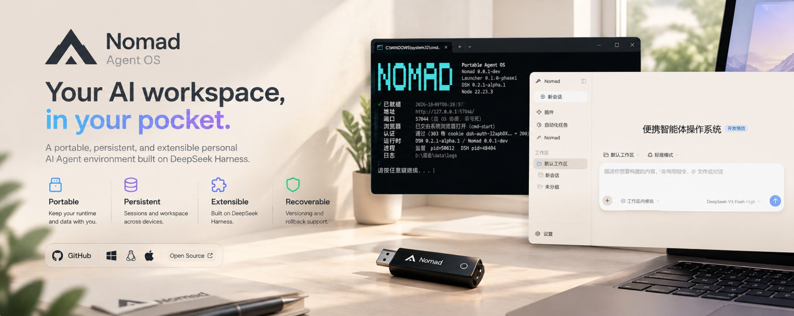
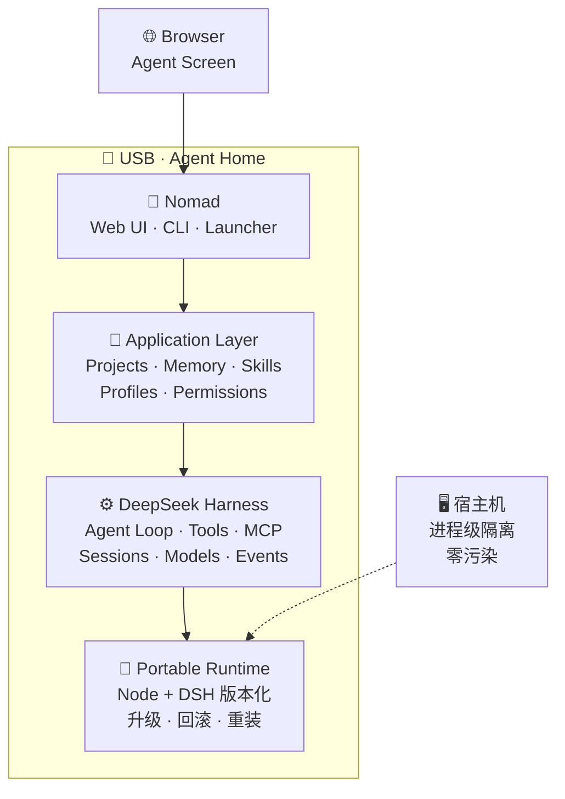

<div align="center">



# 🧭 Nomad

### Portable Agent OS —— 把 Agent 的家装进 U 盘，把浏览器变成它的屏幕

**简体中文** ｜ [English](README.en.md)

[](LICENSE)
[](https://nodejs.org)
[](#6-从源码运行与测试)
[](#6-从源码运行与测试)
[](https://github.com/deepseek-ai/deepseek-harness)
[](#8-部署到-u-盘)

</div>

**Nomad 不重新发明 Agent，而是管理 Agent 的运行环境、个人数据与工作空间，让它更容易迁移、升级和恢复。**

它构建在 [DeepSeek Harness（DSH）](https://github.com/deepseek-ai/deepseek-harness) 之上：DSH 是 Agent 引擎，Nomad 是产品层与便携管理层，U 盘是一种交付与迁移载体（架构上不绑定特定盘符或介质），浏览器是 Web UI 的访问入口。

---

## 1️⃣ 为什么是 Nomad？

本地跑 AI Agent 时，有几类反复出现的实际麻烦：

1. **东西散落各处** —— 运行时、缓存、配置、会话和项目文件往往分散在不同目录，出问题很难一次看清全貌。
2. **迁移容易漏** —— 换电脑或重装系统时，依赖、配置与个人数据可能散落在旧环境里，拼不全。
3. **升级缺策略** —— Agent 引擎迭代很快，直接原地升级没有版本管理与回滚手段，坏了只能重装。
4. **扩展成本高** —— 靠维护上游完整分叉来定制产品能力，长期合并成本会越滚越大。

Nomad 的解决思路（**旨在**做到，边界见[第 10 节](#10-安全凭据与已知限制)）：

- 用 `NOMAD_ROOT` 一个根变量派生全部路径，**尽可能集中管理**运行时、数据与配置；
- Runtime 与 Data **物理分离**：引擎可整体替换、升级、回滚，个人数据原地不动；
- 升级走「新版本目录 + 版本指针」，旧版本保留，`nomad rollback` 一条命令切回；
- 全部定制走上游**官方文档化的扩展点**，对上游源码 **0 修改**（无分叉）。

## 2️⃣ 核心能力与实现状态

| | 能力 | 一句话 |
|:---:|---|---|
| 🎒 | **Portable** | 插上哪台电脑，Agent 就住在哪台电脑的 U 盘里 |
| 💾 | **Persistent** | 升级 Runtime，Memory / Project / Session 不丢 |
| 🔑 | **Personal** | 数据、配置、凭据、会话，集中在你自己的盘里 |
| 🧩 | **Extensible** | 全部定制走官方扩展点，**Core Patch ＝ 0**，不 fork 上游 |
| ⏮️ | **Upgradable** | 版本化升级 + 指针回滚，旧版本始终保留 |
| 🛟 | **Recoverable** | `nomad backup` / `restore`，零依赖备份恢复 |
| 🛡️ | **Isolated** | 进程级宿主隔离：不改环境变量、不动注册表、不动 PATH |

**逐项状态**（依据 = 当前代码、单元测试与真机验证，不是架构图）：

| 能力 | 状态 | 依据与边界 |
| --- | :---: | --- |
| 便携启动器 | ✅ 已验证 | 真实 DSH 端到端冒烟 + 21 项 doctor 体检 + PID 复用安全闸 |
| 版本化 Runtime 与回滚 | ✅ 已验证 | 多版本目录共存，指针切换有专项单测（`tests/runtime-rollback.test.js`）；回滚只影响下次启动 |
| 备份 / 恢复 | ✅ 已验证 | 零依赖递归复制 + 清单对账；单测覆盖排除规则与合并恢复；运行期快照可能捕获写入中途文件 |
| Web UI（面板 / 品牌 / 换肤） | ✅ 已验证 | 真机人眼验收；面板数据走只读端点（仅绑定 127.0.0.1，白名单过滤） |
| Skills 管理 | ✅ 已验证 | 真机热生效实证（装/删无需重启）；装前拦截会被 DSH 忽略的非法来源 |
| Profiles 管理 | ✅ 已验证 | 真机多 profile 列表 / 校验 / 自举 |
| Projects 列表 | ✅ 已实现 | 只读列出盘内工作区与会话数；管理操作未实现 |
| 在线更新（`nomad update`） | ⚠️ 部分 | 查询 / 校验 / 解包 / 装依赖 / 切指针已实现并有单测；**完整升级链路待上游发版后真机首验** |
| Memory 管理 | 🗺️ 规划中 | 数据面巡检已覆盖可清理目录；会话级查看 / 清理尚未实现 |
| 权限管理 | ⚠️ 部分 | `config/permissions.yaml` 模板、doctor 状态展示、never 清单自证已实现；**Nomad 层不做执行拦截**，实际执行依赖上游 DSH 原生权限体系 |
| 宿主隔离 | ✅ 已验证（边界明确） | 进程级：不改环境变量 / 注册表 / PATH，doctor 含宿主污染探针；**不等于操作系统级沙箱**，浏览器状态归宿主 |

**目标体验**：

```text
插入 USB → 启动 Nomad → 浏览器打开 Nomad Web UI
   → 使用 Agent → 重要状态写入 USB → 拔走 USB
   → 换另一台电脑 → 继续工作
```

> 诚实说明：跨机迁移是**设计目标**（路径全部从 `NOMAD_ROOT` 派生、无盘符硬编码），当前已在
> 单机多盘环境下验证；**多台物理机器间的迁移实测尚未进行**。

## 3️⃣ 快速开始

### A. 普通用户（拿到一块装好 Nomad 的 U 盘）

> 当前仓库**尚未发布预打包发行版**（`runtime/` 约 604 MB，不进版本库，也没有 Release 下载）。
> 普通用户的获取方式：拿一块由维护者或协作者按下文[第 8 节](#8-部署到-u-盘)部署好的 U 盘，
> 或按[第 6 节](#6-从源码运行与测试)自行装配运行时。

1. **启动**：双击盘根的 `Nomad.cmd`（Windows）或运行 `./nomad`（Linux / macOS）——就绪后自动打开浏览器；
2. **看状态**：双击 `Nomad-Doctor.cmd` 体检（只读，21 项），或 `Nomad.cmd status`；
3. **停止**：`Nomad-Stop.cmd`（或 `Nomad.cmd stop`）；
4. **备份数据**：`Nomad.cmd backup`（备份到盘内 `data/backups/`）；
5. 打不开浏览器 / 提示 `authentication required`：见下方 [!NOTE]。

> [!NOTE]
> **浏览器显示 `dsh web authentication required`？** 这不是故障，是 DSH 的鉴权设计：
> 访问地址必须带上本次启动的 `?token=…`，裸地址必然 401。依次尝试：
> ① `Nomad.cmd open`；② `Nomad.cmd url` 拿完整地址手动粘进浏览器；
> ③ 在 `config/nomad.yaml` 设置 `web.browser_path` 指定浏览器可执行文件。
> `nomad doctor` 会分别报出「浏览器交接命令」与「Web 认证握手」两项，可直接定位断在哪一环。

> [!TIP]
> 改了插件或配置后**必须重启实例**才生效（客户端模块在启动时组装）——
> `Nomad-Restart.cmd` 是最常用的那一个。

### B. 开发者（从本仓库开始）

```bash
git clone https://github.com/iCurrer/nomad-agent-os.git
cd nomad-agent-os
node --test tests/*.test.js          # 245 项单元测试（零依赖，Node ≥ 20）
node launcher/nomad.js --help        # CLI 入口（源码形态，无 runtime 时部分命令不可用）
node launcher/nomad.js doctor        # 体检
```

完整的运行时装配、日常开发循环与冒烟测试见[第 6 节](#6-从源码运行与测试)与
[`docs/DEVELOPMENT.md`](docs/DEVELOPMENT.md)。

## 4️⃣ 从源码运行与测试

> [!IMPORTANT]
> **本仓库不包含 `runtime/`**（Node + DSH 共 32,089 文件 / 603.7 MB）。运行时按版本独立管理、
> 由 `.gitignore` 排除，**永不进版本库**。仓库内容是 Nomad 自身的**产品层与可移植层**源码
> （116 个跟踪文件 / ≈1.2 MB）。

克隆后有两种用法：

**A. 阅读 / 参与开发 —— 零安装**

`launcher/`、`packages/`、`docs/`、`tests/` 全部是**零 npm 依赖的纯 JS / Markdown**：
无 TypeScript、无构建步骤、无第三方包。唯一需要的是本机 Node 20+ 用于跑测试。

```bash
node --test tests/*.test.js             # 245 项单元测试（25 个测试文件）
node tests/smoke/portable-smoke.js      # 端到端冒烟（替身运行时，无需真实 DSH）
node tests/smoke/stale-state-guard.js   # PID 复用安全闸
node tests/smoke/real-runtime-smoke.js  # 真实 DSH 端到端（需装配 runtime；会停掉在跑的实例）
```

体检覆盖：路径 / Secret / 目录基线 / 运行时包完整性（锁文件对账）/ 隔离 / 端口 /
宿主污染探针 / **盘内字面量目录巡检**（自动发现 `%VAR%` 式误写入）/ 浏览器交接 / Web 认证握手 /
**Skills 装载** / **数据面巡检** / **权限档位自证**。

**B. 完整复现便携运行时（开发机流程）**

Agent 引擎 [`@deepseek-ai/dsh`](https://github.com/deepseek-ai/deepseek-harness) 是**公开 npm 包**，
可按官方版本自行装配运行时（Node 官方包 SHA-256 校验 + `npm install @deepseek-ai/dsh@<version>`）。
完整流水线见 [`docs/DEVELOPMENT.md`](docs/DEVELOPMENT.md) §8 运行时打包流水线。

> 打包好的 `runtime/`（Node v22.23.3 + DSH 0.2.1-alpha.1，32,089 文件 / 603.7 MB）
> 让用户机做到**零编译、零 npm install、无需预装 Node**。详见 [`docs/PHASE1_LAUNCHER.md`](docs/PHASE1_LAUNCHER.md)。

## 5️⃣ 架构一览



> **Runtime 与 Data 物理分离**：`runtime/` 可替换、可升级、可回滚、可重新下载；
> `data/` 必须长期存在 —— 两者**永不混放**。回滚 ＝ 改写版本指针的一行 `entry`
> （清单间接而非符号链接，见 [ADR-0016](docs/DECISIONS.md)）。

## 6️⃣ 部署到 U 盘

```bash
node tools/deploy-usb.js --target E:\ --dry-run              # 预检：只读，打印计划
node tools/deploy-usb.js --target E:\                        # 全量部署：32,144 文件 / 604.1 MB
node tools/deploy-usb.js --target E:\ --app-only --force    # 日常开发：只推 app 层（亚秒级）
```

- **日常开发用 `--app-only`**：跳过 `runtime/`（占 99.5% 体量），只同步约 57 个文件 / 481 KB，
  实测 **1.3 s**。它用版本戳核对 runtime，对不上会拒绝并要求全量 —— 快，但不会漏。
- **用盘符根**（`E:\`），不要套子目录 —— 树里有 1 条 264 字符路径，靠 Node 的 libuv 长路径支持通过，
  余量越小风险越大。
- **白名单驱动**：`vendor/`（上游源码）/ `.cache-dev/`（下载缓存）/ `.workbuddy/` / `data/`
  **一律不随盘**；目标盘 `data/` 全新初始化为空骨架（盘内不落真 key，ADR-0019）。
- **断点续传**：目标端已存在且大小一致的文件会跳过，中断后**原样重跑**即可。
- **部署前先停掉目标盘上的实例**：盘上实例占用着它加载过的文件，覆盖会 `EPERM`
  （工具会在复制前用「可覆盖探针」提前报出）。
- 部署完成后在盘上双击 `Nomad-Doctor.cmd` 体检、`Nomad.cmd` 启动（已在运行时用 `Nomad-Restart.cmd`）。
- 介质说明：U 盘是当前**实测过的交付载体**；架构上路径全部从 `NOMAD_ROOT` 派生、无盘符硬编码，
  本地磁盘 / 移动硬盘等目录在原理上同样可用，但未逐一实测。
- 详见 [`docs/DEPLOY.md`](docs/DEPLOY.md) 与 **ADR-0027**。

## 7️⃣ 仓库结构与开发指南

| 路径 | 说明 |
| --- | --- |
| `launcher/` | **启动器（零依赖 Node CLI + 运行时监督进程）** |
| `packages/` | L4-a 补丁层 + 品牌 / 自有面板 / 换肤 / 语言包 等零构建客户端插件 |
| `config/` | `nomad.yaml` `providers.yaml` `permissions.yaml` `compatibility.yaml` |
| `tests/` | 单元测试 + 端到端冒烟 + 替身运行时 fixture |
| `docs/` | 架构 / 源码地图 / 数据模型 / 可移植性 / 安全 / 测试 / 上游 / **决策（ADR）** / UI / 开发 / 路线 / 启动器 / 部署 |
| `tools/` | 开发机工具（**部署到可移动盘**：`tools/deploy-usb.js`） |
| `AGENTS.md` | **AI 开发规则宪法（必读）** |
| `LICENSE` | **MIT 许可全文** |
| `THIRD_PARTY_NOTICES.md` | 第三方组件与许可聚合声明 |
| `runtime/` `data/` `workspace/` `skills/` `profiles/` `mcp/` | 运行时与用户数据 —— **不进版本库**（见 `.gitignore`） |

开发文档入口：[`docs/DEVELOPMENT.md`](docs/DEVELOPMENT.md)（日常流程）·
[`docs/ROADMAP.md`](docs/ROADMAP.md)（里程碑）· [`docs/DECISIONS.md`](docs/DECISIONS.md)（技术决策）。

**给 AI 编程助手**：每个新会话第一条消息粘贴 [`docs/BOOTSTRAP_PROMPT.md`](docs/BOOTSTRAP_PROMPT.md)，并遵守 [`AGENTS.md`](AGENTS.md)。

## 8️⃣ 安全、凭据与已知限制

- **进程级隔离 ≠ 操作系统沙箱**：Nomad 不修改系统环境变量、不改注册表、不动 PATH，
  doctor 有宿主污染探针守着这条线；但它**不是**操作系统级的强隔离，不能防住一切宿主侧写入。
- **浏览器是宿主的**：它的历史 / 缓存 / 会话不归 Nomad 管理（见 [`docs/HOST_ISOLATION.md`](docs/HOST_ISOLATION.md)）。
- **凭据安全**：模型 API key 保存在盘内 `data/dsh-home/.credentials.yaml`（**明文**）。
  请自行妥善保管载体；`data/` 永不入库。
- **备份包含敏感数据**：`nomad backup` 会复制盘内 `data/`（含凭据与会话记录），
  备份目录请与盘体同等保管。
- **尚无加密能力**：盘内凭据与备份当前**没有**额外加密层，安全性依赖物理载体保管。
- **回滚边界**：`nomad rollback` 切换的是运行时版本指针（只影响下次启动）；它**不自动逆转**
  数据结构变化，极端情况下新版本写入的数据格式未必被旧版本完整理解。
- DSH 仍处于 developer preview：**不追踪 master、不自动升级**，一律走版本化 Runtime + 可回滚流程。

## 9️⃣ 开发路线图

| 阶段 | 目标 | 状态 |
|:---:| --- | --- |
| Phase 0 | Source Reconnaissance → `docs/DSH_SOURCE_MAP.md` | ✅ 已完成 |
| Phase 1 | Portable Bootstrap（Launcher → DSH → Web → Browser） | ✅ 已完成（运行时已打包，真实 DSH 端到端闭环） |
| Phase 2 | Nomad Web UI（V1 闭环：面板 / 品牌 / 换肤 / 生命周期命令） | ✅ 已完成 V1 |
| Phase 3 | Nomad Agent OS（Profiles / Skills / 数据面 / Permissions / Runtime Manager / 面板整合） | ✅ 已完成（真机验收收尾中） |

里程碑与勾选明细见 [`docs/ROADMAP.md`](docs/ROADMAP.md)，技术决策见 [`docs/DECISIONS.md`](docs/DECISIONS.md)。

## 🔟 许可、归属与参与贡献

- **Nomad 基于 DeepSeek Harness（DSH）构建** —— Agent 引擎由上游提供，Nomad 只做产品层与可移植层。

| 组件 | 许可 | 说明 |
| --- | --- | --- |
| **Nomad（本项目）** | [MIT](LICENSE) · © 2026 iCurrer | 各 `packages/*/package.json` 均已声明 `"license": "MIT"` |
| **上游 `@deepseek-ai/dsh`** | MIT · © 2026 [DeepSeek](https://github.com/deepseek-ai/deepseek-harness) | 公开仓库，公开构建合规 |
| **561 个传递依赖** | MIT / Apache-2.0 / ISC / BSD 为主 | **无 GPL / AGPL 等强 copyleft**，聚合清单见 [`THIRD_PARTY_NOTICES.md`](THIRD_PARTY_NOTICES.md) |

> 依赖关系说明：「零依赖」指 **Nomad 产品层代码**（`launcher/` / `packages/` 纯 Node 标准库，
> 无任何第三方包）；上游引擎 `@deepseek-ai/dsh` 自带上述 561 个传递依赖，随 `runtime/` 分发。

- **未修改上游源码**：Core Patch 数 ＝ **0**，全部定制通过官方文档化扩展点完成
  （Cordis 插件 / `cordis.patch.yml` 行补丁 / 客户端插件槽位 / 主题 token 覆盖 / locale 语言包）。
- **商标声明**：DSH / DeepSeek Harness 是深度求索公司的注册商标，未经授权不得用作项目名
  —— 本项目名 `Nomad` 不含该商标。Nomad 为独立项目，与 DeepSeek
  **无隶属、无赞助，亦无背书关系**。「基于 DeepSeek Harness 构建」属上游
  `BRAND_GUIDELINES` 明确许可的描述性用法。界面内亦有一份同源声明：Nomad 面板 → **About** 区块。

**参与贡献**：欢迎通过 [Issues](https://github.com/iCurrer/nomad-agent-os/issues) 反馈问题与建议；
提交 PR 前请先阅读 [`AGENTS.md`](AGENTS.md)（开发规则）与
[`docs/DEVELOPMENT.md`](docs/DEVELOPMENT.md)（流程），并确保 `node --test tests/*.test.js` 全绿。

---

<div align="center">

**Nomad** · 构建在 [DeepSeek Harness](https://github.com/deepseek-ai/deepseek-harness) 之上 · 以 [MIT](LICENSE) 发布

</div>
